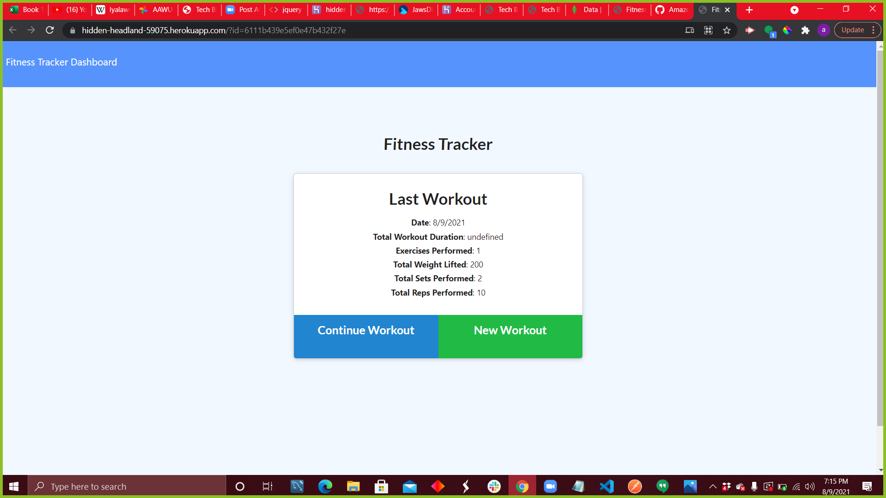

# Workout Tracker
  
  ## Description
  helps track your workouts

  * Used Week 17 Exercise 26 as a guide for this hw

## Link to Application
[app](https://hidden-headland-59075.herokuapp.com/?id=6111b439e5ef0e47b432f27e/)

## Example

  ## Table of contents
  
  * [Usage](#usage)
  * [Contributing](#contributing)
  * [Installation](#installation)
  * [Testing](#testing)
  * [License](#license)
  * [Question](#question)
  
  ## Usage
   helps track your workouts 

  ## Contributing
  Create a git hub issue

  ## Installation
  to install dependencies:
  npm i

  

  ## License
  MIT
  

 ## Questions
 Email me at Ashleydelacruz999@gmail.com or Git Hub Amazonash
  

